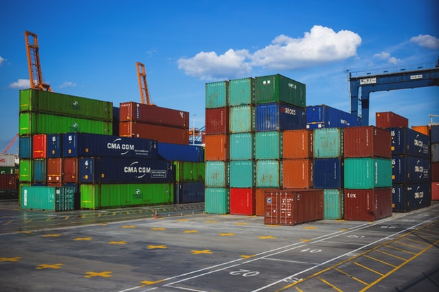

Containers are becoming the standard way of deploying software. Every cloud vendor now offers one or multiple ways to run containers on their platform. Most of our clients uses AWS to host their SaaS solution. As part of a new development for one of our clients we have decided to move away from [Elastic Beanstalk](https://docs.aws.amazon.com/elasticbeanstalk/latest/dg/Welcome.html) and embrace containers. Amazon [Elastic Container Service](https://aws.amazon.com/ecs/) is an orchestration service that supports Docker containers and is generally available for over a year. Given our small development team it seemed like the best choice since it takes away most of the cluster management headaches. In this post I will describe how we deploy a container to ECS using [CloudFormation](https://aws.amazon.com/cloudformation/).



## ECS Cluster definition

At [Bright Inventions](https://brightinventions.pl/) we often use CloudFormation for infrastructure configuration since it allows us to version and track changes easily. The first piece of infrastructure we need is an [ECS cluster](https://docs.aws.amazon.com/AmazonECS/latest/developerguide/ECS_clusters.html). A cluster is a logical group of tasks/containers running inside ECS. In particular, since we will be using [EC2 Launch Type](https://docs.aws.amazon.com/AmazonECS/latest/developerguide/launch_types.html), a cluster can also be though of as a group of EC2 instances with an ECS Agent installed.


```json
"ECSMainCluster": {
    "Type": "AWS::ECS::Cluster",
    "Properties": {
        "ClusterName": "app-stack-main"
    }
},
"ECSAutoScalingGroup": {
    "Type": "AWS::AutoScaling::AutoScalingGroup",
    "Properties": {
        "VPCZoneIdentifier": [
            { "Ref": "PrivateASubnet" },
            { "Ref": "PrivateBSubnet" }
        ],
        "LaunchConfigurationName": {
            "Ref": "ContainerHostInstances"
        },
        "MinSize": "1",
        "MaxSize": "6",
        "DesiredCapacity": "1",
        "Tags": [
            {
                "Key": "Name",
                "Value": "app-stack-ecs",
                "PropagateAtLaunch": true
            }
        ]
    },
    "CreationPolicy": {
        "ResourceSignal": {
            "Timeout": "PT5M"
        }
    },
    "UpdatePolicy": {
        "AutoScalingReplacingUpdate": {
            "WillReplace": "true"
        }
    }
}
```

As you can see above, the `ECSMainCluster` is mostly a declaration. What follows is an auto scaling group that will launch and manage EC2 instances. The `VPCZoneIdentifier` lists 2 VPC subnets created in separate availability zones. This is vital for availability as it causes the EC2 instances to run on physically separate hardware. For brevity, I've omitted their configuration from this post. However, if you are interested in this topic head over [to this post](https://sookocheff.com/post/aws/how-to-create-a-vpc-using-cloudformation/). The specified `LaunchConfigurationName` named `ContainerHostInstances` details how the EC2 instance should look like.

```json
"ContainerHostInstances": {
    "Type": "AWS::AutoScaling::LaunchConfiguration",
    "Properties": {
        "ImageId": "ami-880d64f1",
        "SecurityGroups": [
            { "Ref": "ECSSecurityGroup" }
        ],
        "InstanceType": "t2.medium",
        "IamInstanceProfile": { "Ref": "ECSHostEC2InstanceProfile" },
        "KeyName": "private-key-pair",
        "UserData": {
            "Fn::Base64": {
                "Fn::Join": [
                    "",
                    [
                        "#!/bin/bash -xe\n",
                        "echo ECS_CLUSTER=",
                        {
                            "Ref": "ECSMainCluster"
                        },
                        " >> /etc/ecs/ecs.config\n",
                        "yum install -y aws-cfn-bootstrap\n",
                        "/opt/aws/bin/cfn-signal -e $? ",
                        "         --stack ",
                        {
                            "Ref": "AWS::StackName"
                        },
                        "         --resource ECSAutoScalingGroup ",
                        "         --region ",
                        {
                            "Ref": "AWS::Region"
                        },
                        "\n"
                    ]
                ]
            }
        }
    }
},
"ECSHostEC2InstanceProfile": {
    "Type": "AWS::IAM::InstanceProfile",
    "Properties": {
        "Path": "/",
        "Roles": [
            {
                "Ref": "ECSHostEC2Role"
            }
        ]
    }
},
```

The first important property is the `ImageId` which uses [Amazon ECS-optimized Linux AMI ID](https://docs.aws.amazon.com/AmazonECS/latest/developerguide/ecs-optimized_AMI.html). Next we have a security group that adds rules for incoming traffic on application ports. Next we have `IamInstanceProfile` which references an instance profile `ECSHostEC2InstanceProfile` that in turn [assumes a role policy required by the ECS Agent](https://docs.aws.amazon.com/AmazonECS/latest/developerguide/instance_IAM_role.html) to deploy and configure containers.
Inside `UserData` we define a shell script that informs ECS Agent about the cluster it is running in. I will omit `ECSHostEC2Role` definition since [it is well described in the documentation](https://docs.aws.amazon.com/AmazonECS/latest/developerguide/instance_IAM_role.html).

With the above we are now ready to deploy an ECS Cluster through CloudFormation template. However, a cluster without containers is pretty meaningless.

## ECS Service and Task definition

In AWS lingo [an ECS Service](https://docs.aws.amazon.com/AmazonECS/latest/developerguide/ecs_services.html) describes a minimal configuration required to deploy and run a Task Definition. A [Task Definition](https://docs.aws.amazon.com/AmazonECS/latest/developerguide/task_definitions.html) in turn describes how to configure and run a set of containers that form a single logical component.

```json
"EmailSenderService": {
    "Type": "AWS::ECS::Service",
    "Properties": {
        "Cluster": { "Ref": "ECSMainCluster" },
        "DesiredCount": 2,
        "DeploymentConfiguration": { "MinimumHealthyPercent": 50 },
        "Role": { "Ref": "ECSServiceRole" },
        "TaskDefinition": { "Ref": "EmailSenderTask" }
    }
},
"EmailSenderTask": {
    "Type": "AWS::ECS::TaskDefinition",
    "Properties": {
        "Family": "app-stack-email-sender",
        "ContainerDefinitions": [{
            "Name": "app-stack-email-sender",
            "Essential": "true",
            "Image": { "Ref": "EmailSenderTaskDockerImage" },
            "LogConfiguration": {
                "LogDriver": "awslogs",
                "Options": {
                    "awslogs-group": { "Ref": "EmailSenderLogsGroup" },
                    "awslogs-region": { "Ref": "AWS::Region" },
                    "awslogs-stream-prefix": "email-sender",
                    "awslogs-datetime-format": "%Y-%m-%d %H:%M:%S.%L"
                }
            },
            "PortMappings": [{ "ContainerPort": 8080 }],
            "Environment": [{
                "Name": "DEPLOY_ENV",
                "Value": { "Ref": "DeployEnv" }
            }]
        }]
    }
},
"EmailSenderLogsGroup": {
    "Type": "AWS::Logs::LogGroup",
    "Properties": {
        "LogGroupName": "app-stack-email-sender",
        "RetentionInDays": 14
    }
}
```

The `EmailSenderService` is pretty straightforward to understand. The `EmailSenderTask` defines a single container. The `app-stack-email-sender` task definition states that the `Image` is a reference to a parameter passed in to the CloudFormation template when creating or updating the stack. Its value must [be a name of a Docker image](https://docs.docker.com/engine/reference/commandline/pull/#pull-from-a-different-registry) that can be pulled by the ECS Agent. The repository can either be [public](https://hub.docker.com/) or private. When hosting your own, private Docker image repository you need to make sure the ECS Agent [has the correct credentials configured](https://docs.aws.amazon.com/AmazonECS/latest/developerguide/private-auth.html). Thankfully there is [Elastic Container Registry](https://aws.amazon.com/ecr/) which offers private repositories that are automatically configured when using ECS as long as `ECSHostEC2Role` policy [allows ECR related actions](https://docs.aws.amazon.com/AmazonECS/latest/developerguide/instance_IAM_role.html).

Next we have the `LogConfiguration` that pushes containers logs to the `EmailSenderLogsGroup` CloudWatch Log Group so that we can can inspect them through AWS Console. The `PortMappings` lists ports exposed by a running container. Note that we have not defined the host port and it will get assigned automatically. This is important when running multiple instances of the same container. I'll describe it in a bit more detail in the next post. Last but not least the `Environment` section lists environment variables passed to the container instances on startup. Here we are referencing a `DeployEnv` stack parameter that allows us to inform the application running inside the container about the current deployment environment e.g. staging vs production.

As you can see above it takes couple of steps to use CloudFormation to deploy a container to ECS. It is true that it requires more configuration than Elastic Beanstalk. However, it allows for better utilization of EC2 instances and an uniform approach to deployment and configuration regardless of the application technology used inside the container. Moreover it is more future proof as with few adjustments it should be possible to switch to [Fargate Launch Mode](https://docs.aws.amazon.com/AmazonECS/latest/developerguide/launch_types.html). Using this mode releases us from the burden of EC2 ECS cluster management tasks. Deploying more services and tasks will require separate CloudFormation resource definitions. However, with the help of [cloudform](https://brightinventions.pl/blog/introducing-cloudform-tame-aws-cloudformation-templates/) it easy keep the CloudFormation template DRY.

