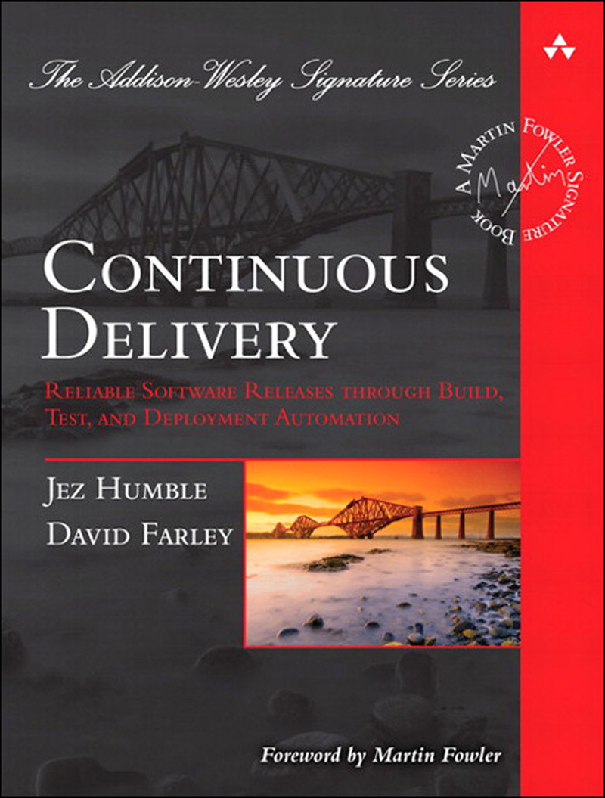

I encourage everyone to read books. There's so many titles worth
reading [that entire lists have been created](https://github.com/EbookFoundation/free-programming-books)
. Depending on the stage of your career you'll need books covering various topics. Here is a list I
recommend every junior and mid-level software engineer should read.

## [Head First Design Patterns by Eric Freeman, Elisabeth Robson](https://www.amazon.pl/Head-First-Design-Patterns-Object-Oriented/dp/149207800X)

Design pattern surround us everywhere. They are prevalent in every framework and most libraries we
use. The "Head First Design Patterns" presents most common design patterns in a succinct and easy to
remember fashion. Before you'll finish the book, you'll already better understand the design choices
behind libraries and frameworks that you use!
The form of writing that the book uses is especially enjoyable. You'll definitely not be bored by
this one.

## [Clean Architecture by Robert C. Martin](https://www.amazon.com/Clean-Architecture-Craftsmans-Software-Structure/dp/0134494164)

Every book by "Uncle Bob" is worth reading. I've picked the "Clean Architecture" for the list as it
provides a base and set of pillars with which you can create software services that are easier to
reason about. The book describes many important rules. At its core a high level approach to
application architecture is
summarized [in the author's blog post](https://blog.cleancoder.com/uncle-bob/2012/08/13/the-clean-architecture.html)
. Make no mistake though, you'll gain much more from reading the book end-to-end!

## [Continuous Delivery: Reliable Software Releases through Build, Test, and Deployment Automation by Jez Humbe and David Farley ](https://www.amazon.com/Continuous-Delivery-Deployment-Automation-Addison-Wesley/dp/0321601912)

The book was a hit when it was first published over 10 years ago. If you want to know more about
Continuous Integration and Continuous Deployment this book is a must-read. It unfolds and explains
multiple techniques and approaches to improve delivery of software. You'll learn not only what to do
to improve how you develop software. You'll also learn why some techniques work while other don't.
Such knowledge helps immensely with managing backlog of non-functional features.

## [Release It!: Design and Deploy Production-Ready Software](https://www.amazon.com/Release-Design-Deploy-Production-Ready-Software/dp/1680502395)

Have you ever hears a dreadful story about software system bringing a major enterprise to its knees?
Have you ever wondered what it takes for a software to be mature and reliable? If so you'll love
this piece. With a mixture of technical insights and best practices coloured with production stories
this books reads like a novel. It explains in depth multiple techniques that improve resiliency of
software systems. Circuit breaker, bulk head and redundancy will be your bread and butter after you
get yourself familiar with what Michael T. Nygard describes.

What are the books that you think are worth reading? Please post comments with your recommendations!
