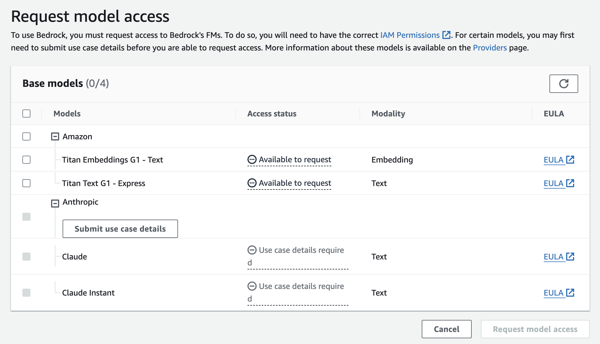

AI is taking over the world. At Bright Inventions, we've already helped several clients with generative AI.  
In this blog post, we'll see how to use aws-cdk to create a simple API that responds to prompts.

## Request Bedrock model access

If you haven't used Bedrock before, the first step is to request model access.

You can do so
in [AWS Console > Bedrock Model > access page](https://eu-central-1.console.aws.amazon.com/bedrock/home?region=eu-central-1#/modelaccess):


For Claude and Claude Instant models describe your use case briefly.

## Define your AWS Lambda function with aws-cdk

Declaring an AWS Lambda function with aws-cdk is straightforward. Our function needs to invoke Bedrock models, hence
appropriate IAM permissions are necessary. For simplicity, we'll use AWS Lambda Function URLs with authentication type
NONE.
You should use that only for evaluation purposes.

```typescript
export class BrightBedrockSimpleStack extends cdk.Stack {
  constructor(scope: Construct, id: string, props?: cdk.StackProps) {
    super(scope, id, props);

    const lambdaPrompt = new NodejsFunction(this, 'lambda', {
      architecture: Architecture.ARM_64,
      timeout: Duration.seconds(30),
      entry: path.join(process.cwd(), 'lib', 'bedrock-client', 'simple-api.lambda.ts'),
    })

    lambdaPrompt.addToRolePolicy(new PolicyStatement({
      actions: ['bedrock:InvokeModel'],
      resources: ['*']
    }))

    const functionUrl = lambdaPrompt.addFunctionUrl({
      authType: FunctionUrlAuthType.NONE
    });

    new CfnOutput(this, 'function-url', {
      value: functionUrl.url
    });
  }
}
```

## Invoking Bedrock amazon.titan-text-express-v1

Bedrock provides multiple models. The models differ not only in terms of their capabilities but also in their API. For
starters, let's use Titan Text Express.

```typescript
export const handler: APIGatewayProxyHandlerV2 = async (event, context) => {
  const body = event.body!

  const response = await bedrock.send(new InvokeModelCommand({
    body: JSON.stringify({
      inputText: body,
    }),
    contentType: 'application/json',
    modelId: "amazon.titan-text-express-v1"
  }));

  const modelResponseJson = response.body.transformToString();

  return {
    statusCode: response.$metadata.httpStatusCode ?? 500,
    headers: {
      'Content-Type': response.contentType
    },
    body: modelResponseJson
  }
}
```

After we deploy the code, we can invoke our function and ask basic questions, e.g.

```shell
curl -s -X POST --location "https://${YOUR_LAMBDA_ID}.lambda-url.eu-central-1.on.aws" \
    -H "Content-Type: text/plain" \
    -d 'Which country has the highest GDP?' | jq
{
  "inputTextTokenCount": 7,
  "results": [
    {
      "tokenCount": 34,
      "outputText": "\nThe country that has the highest GDP is the United States. Its total GDP is $23.07 trillion in terms of purchasing power parity (PPP).",
      "completionReason": "FINISH"
    }
  ]
}

```

## Titan Text Express configuration

We can control and tweak some the aspects of how the model responds to our prompts. For example, for Titan Text Express
we can
configure:

- temperature: Float value to control randomness in the response (0 to 1, default 0). Lower values decrease randomness.
- topP: Float value to control the diversity of options (0 to 1, default 1). Lower values ignore less probable options.
- maxTokenCount: Integer specifying the maximum number of tokens in the generated response (0 to 8,000, default 512).
- stopSequences: Array of strings indicating where the model should stop generating text. Use the pipe character (|) to
  separate different sequences (up to 20 characters).

Let's modify our lambda to allow controlling the parameters.

```typescript
const response = await bedrock.send(new InvokeModelCommand({
  body: JSON.stringify({
    inputText: body,
    textGenerationConfig: {
      temperature: parseFloat(event.queryStringParameters?.temperature ?? '') || undefined,
      topP: parseFloat(event.queryStringParameters?.topP ?? '') || undefined,
      maxTokenCount: parseInt(event.queryStringParameters?.maxTokenCount ?? '') || undefined,
    }
  }),
  contentType: 'application/json',
  modelId: "amazon.titan-text-express-v1"
}));
```

After deploying, we can control the model parameters through query string parameters:

```shell
curl -X POST --location "https://g66m7el4jcrtwarntzrcfps2tq0yduar.lambda-url.eu-central-1.on.aws?temperature=0.9" \
    -H "Content-Type: text/plain" \
    -d 'What is the country that has the most freedom of speech in the world?'
    
{
  "inputTextTokenCount": 15,
  "results": [
    {
      "tokenCount": 28,
      "outputText": "\n\"The United States has the most freedom of speech in the world, according to the 2022 Freedom House Index.\" ",
      "completionReason": "FINISH"
    }
  ]
}    
```

The results will be more elaborate if we change `topP`.

```shell
curl -X POST --location "https://g66m7el4jcrtwarntzrcfps2tq0yduar.lambda-url.eu-central-1.on.aws?temperature=0.9&topP=0.1" \
    -H "Content-Type: text/plain" \
    -d 'What is the country that has the most freedom of speech in the world?'
    
{
  "inputTextTokenCount": 15,
  "results": [
    {
      "tokenCount": 51,
      "outputText": "\n\"The United States is considered the country that has the most freedom of speech in the world. This freedom is protected by the First Amendment of the U.S. Constitution, which guarantees the right to freedom of expression, assembly, and religion.\" ",
      "completionReason": "FINISH"
    }
  ]
}    
```

## Summary

As you see, it is straightforward to get started with AWS Bedrock. The full example of this blog post is available in
[GitHub repo](https://github.com/bright/bright-aws-cdk-bedrock).

