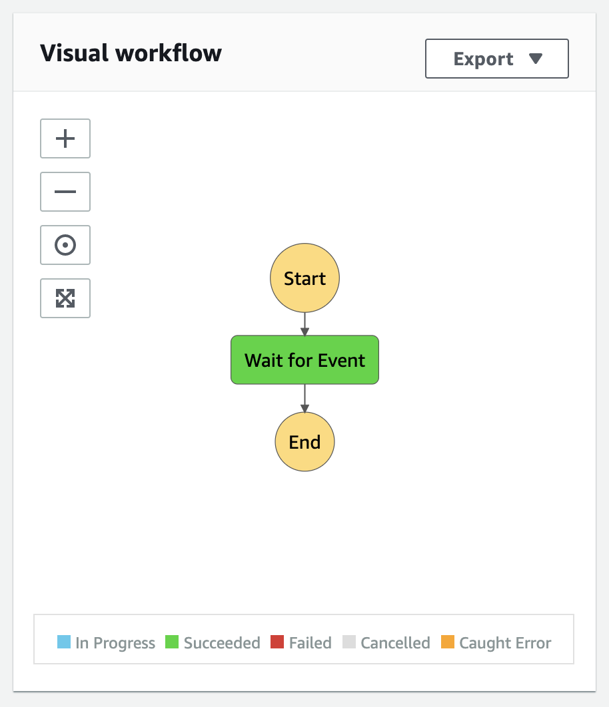
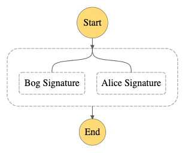

[AWS Step Functions][aws-step-functions] allow one to execute & coordinate **long-running** processes.
Step Functions fall into serverless AWS services, and the platform manages the function execution state completely.

In the example below we will use the following AWS services:

- aws-cdk
- Step Function
- Lambda

The example demonstrates how Step Functions manage execution of a process, which involves external events e.g. human interaction.


## Define step function

I will use blank infrastructure project created with

```shell script
mkdir step-function && cd step-function
npx cdk init --language typescript
```

Next we need to add required packages:

```shell script
cd step-function
npm i --save @aws-cdk/aws-stepfunctions \
  @aws-cdk/aws-stepfunctions-tasks \
  @aws-cdk/aws-lambda-nodejs \
  @aws-cdk/aws-dynamodb
```

We start with a state machine that contains a single `Wait` step as follows.

```typescript
import { WaitTime } from "@aws-cdk/aws-stepfunctions";
import { Duration } from "@aws-cdk/core";
import * as cdk from "@aws-cdk/core";
import * as sfn from "@aws-cdk/aws-stepfunctions";

export class StepFunctionStack extends cdk.Stack {
  constructor(scope: cdk.Construct, id: string, props?: cdk.StackProps) {
    super(scope, id, props);

    const wait = new sfn.Wait(this, "Wait for Event", {
      time: WaitTime.duration(Duration.seconds(5)),
    });

    new sfn.StateMachine(this, "Step Function", {
      definition: wait,
    });
  }
}
```

We deploy it with the usual aws-cdk deploy invocation

```shell script
AWS_PROFILE=my-aws-profile npm run cdk deploy
```

After a few moments we can find our brand new AWS Step Function visual representation in AWS Web Console:



## Define workflow in AWS Step Function

In order to make our example more interesting let's add a bit complexity to it.
Imagine we handle a document flow, which requires two separate actors to sign it off.

The actors act independently. The first signer, Alice, signs documents quickly.
The other, Bob, can take a couple of days to process a document.

Once both actors sign the document our flow succeeds. However, if we do not collect the signatures
until some time elapses the flow fails.

<p class="note">
In order for the `@aws-cdk/aws-lambda-nodejs` to work properly you need to have Docker running
</p>

Alice's part consists of a single task along with a lambda function.

```typescript
const signDocument = new lambda.NodejsFunction(this, "Sign Document", {
  entry: __dirname + "/sign-document.ts",
  handler: "signDocument",
});

const aliceSignature = new sfn.Task(this, "Alice Signature", {
  task: new tasks.RunLambdaTask(signDocument, {
    payload: sfn.TaskInput.fromObject({
      signer: "Alice",
      documentId: Data.stringAt("$.documentId"),
    }),
  }),
});
```

The `signDocument` lambda function handler defined in `step-function/lib/sign-document.ts` looks as follows:

```typescript
import { Handler } from "aws-lambda";

const delay = (millis: number) =>
  new Promise((resolve) => setTimeout(resolve, millis));

export const signDocument: Handler<{
  documentId: string;
  signer: string;
}> = async (event) => {
  await delay(1000);
  console.log("Sign document", event);
  return {
    result: `${event.signer} signed ${event.documentId}`,
  };
};
```

Please note that the lambda function can be async as long as it completes within the regular AWS Lambda function rules.

Bob's signature is a more complex job. Since Bob can take several days to process a request to sign a document we cannot simply use lambda.

In order to solve that we will split the processing into 2 lambda functions using `ServiceIntegrationPattern.WAIT_FOR_TASK_TOKEN`.
The first one will receive step function token and store it in a DynamoDb table. That simulates reaching out to Bob e.g. through email.

The second one will retrieve the token from the DynamoDb table and mark the Step function task as complete.

```typescript
const signRequestsTable = new dynamodb.Table(this, "Signature Requests", {
  billingMode: BillingMode.PAY_PER_REQUEST,
  partitionKey: { name: "documentId", type: AttributeType.STRING },
});

const requestDocumentSignature = new lambda.NodejsFunction(
  this,
  "Request Document Signature",
  {
    entry: __dirname + "/sign-document.ts",
    handler: "requestDocumentSignature",
    environment: {
      signRequestsTableName: signRequestsTable.tableName,
    },
  }
);

const completeSignatureRequest = new lambda.NodejsFunction(
  this,
  "Complete Document Signature",
  {
    entry: __dirname + "/sign-document.ts",
    handler: "completeSignatureRequest",
    environment: {
      signRequestsTableName: signRequestsTable.tableName,
    },
  }
);

signRequestsTable.grantReadWriteData(requestDocumentSignature);
signRequestsTable.grantReadWriteData(completeSignatureRequest);

const bobSignature = new sfn.Task(this, "Bob Signature", {
  task: new tasks.RunLambdaTask(requestDocumentSignature, {
    integrationPattern: ServiceIntegrationPattern.WAIT_FOR_TASK_TOKEN,
    payload: sfn.TaskInput.fromObject({
      stepFunctionToken: sfn.Context.taskToken,
      signer: "Bob",
      documentId: Data.stringAt("$.documentId"),
    }),
  }),
});
```

Last but not least we need to allow the `completeSignatureRequest` to adjust step function state through IAM Policy Statement.

```typescript
const waitForSignaturesTimeout = Duration.seconds(60);
const stateMachine = new sfn.StateMachine(this, "Step Function", {
  definition: flow,
  timeout: waitForSignaturesTimeout,
});

completeSignatureRequest.addToRolePolicy(
  new iam.PolicyStatement({
    actions: ["states:SendTaskSuccess", "states:SendTaskFailure"],
    resources: [stateMachine.stateMachineArn],
  })
);
```

After we deploy our updated stack the function definition should look as follows:



## Call Step Function callback from AWS Lambda

For our workflow to complete we need to implement Bob's lambda part.
Let's start with a function that simulates starting a long-running business process.
The important bit in `sendSignatureRequest` is that it stores state function task token.
We will use the token later on to call AWS Step Function back.
The callback will include result. In our case a fake signature of a document.

First add 2 more packages to our project:

```shell script
npm i --save @types/aws-lambda aws-sdk
```

Then update the AWS Lambda `sendSignatureRequest` definition:

```typescript
import { Handler } from "aws-lambda";
const DynamoDb = require("aws-sdk/clients/dynamodb");

interface SignDocumentEvent {
  documentId: string;
  signer: string;
  stepFunctionToken: string;
}

const documentClient = new DynamoDb.DocumentClient();
const signRequestsTableName = process.env.signRequestsTableName;

export const requestDocumentSignature: Handler<SignDocumentEvent> = async (
  event
) => {
  console.log("Request signature for", event);

  await documentClient
    .put({
      TableName: signRequestsTableName,
      Item: event,
    })
    .promise();
};
```

The last missing piece is to implement the `completeSignatureRequest` lambda function.
The important bit is to call `sendTaskSuccess` to indicate that processing completed successfully.

```typescript
import { Handler } from "aws-lambda";
const StepFunctions = require("aws-sdk/clients/stepfunctions");
const DynamoDb = require("aws-sdk/clients/dynamodb");
const documentClient = new DynamoDb.DocumentClient();
const signRequestsTableName = process.env.signRequestsTableName;
const stepFunctions = new StepFunctions();
export const completeSignatureRequest: Handler<{ documentId: string }> = async (
  event
) => {
  const tableItem = await documentClient
    .get({
      TableName: signRequestsTableName,
      Key: { documentId: event.documentId },
    })
    .promise();

  const signRequest: SignDocumentEvent = tableItem.Item;
  console.log("Received signature for", signRequest);

  const output = JSON.stringify({
    signature: `${signRequest.signer} signed ${signRequest.documentId}`,
  });

  await stepFunctions
    .sendTaskSuccess({
      output: output,
      taskToken: signRequest.stepFunctionToken,
    })
    .promise();
};
```

Let's test the execution by requesting a document with id equal to 3. 
As expected Alice signs the document after couple of seconds. 
However, for in order to get Bob's signature we invoke complete signature lambda. 
This simulates an action that involves human interaction. 
Note that the whole process could take months to complete! 
 
The AWS Step Function console depicts the current phase of processing pretty neatly.
`vimeo: https://vimeo.com/420803128`

You can find [full working example in Github repository][github-example].

Leave a comment if you like the article and would like to see more!

[github-example]: https://github.com/miensol/miensol.github.io/tree/develop/content/posts/aws-step-function-with-cloudwatch-events/step-function
[aws-step-functions]: https://aws.amazon.com/step-functions/
