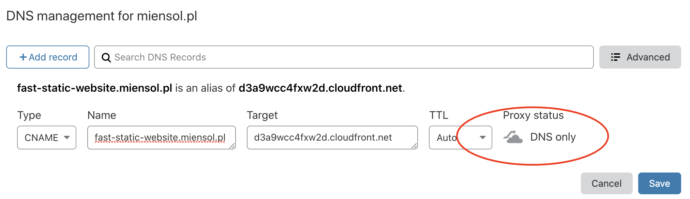
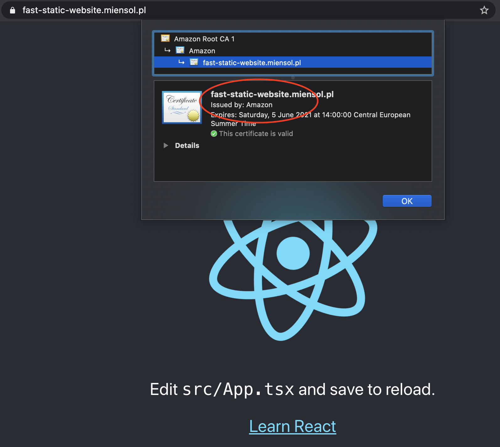

[The static website deployed with aws-cdk to CloudFront post](../fast-static-website-with-aws-cdk)
shows how to deploy static content with aws-cdk. We still miss a custom domain configuration for
our website though. The following example shows how to:

- setup a custom domain name for a CloudFront distribution
- enable https using AWS issued trusted certificate

## Get a trusted certificate from AWS Certificate Manager using aws-cdk

Using the [example from previous post as a base][repository], inside `infrastructure` directory, let's add
additional package:

```shell script
npm i --save @aws-cdk/aws-certificatemanager
```

CloudFront can only use AWS Certificate Manager issued certificates inside us-east-1 region (N. Virginia).
We can create our `FrontendStack` in us-east-1 region. Alternatively we can create another stack with the certificate only.
Below I show how to use the second option.

```typescript
...
import { ValidationMethod } from "@aws-cdk/aws-certificatemanager";
import * as cm from "@aws-cdk/aws-certificatemanager";

const domainName = "fast-static-website.miensol.pl";

export class CertificateStack extends cdk.Stack {
  constructor(scope: cdk.Construct) {
    super(scope, "CertificateStack", {
      env: { region: "us-east-1" },
    });

    const certificate = new cm.Certificate(this, "CustomDomainCertificate", {
      domainName: domainName,
      validationMethod: ValidationMethod.DNS,
    });

    const certificateArn = certificate.certificateArn;
    new CfnOutput(this, "CertificateArn", {
      value: certificateArn,
    });
  }
}
...
```

We request a certificate for a given domain name in us-east-1 region.
Before AWS Certificate Manager issues a trusted TLS certificate it needs to verify that you own
the domain. The validation happens using either:

- email: AWS CM sends a message to _admin_ email addresses for the domain
- DNS: AWS CM requests a particular DNS record configuration

In the example above I use `fast-static-website.miensol.pl` with DNS validation method. Since I own
the domain I can prove that to AWS Certificate Manager.

We also update the `bin/infrastructure.ts` file to include our new stack:

```typescript
#!/usr/bin/env node
import "source-map-support/register";
import * as cdk from "@aws-cdk/core";
import { CertificateStack, FrontendStack } from "../lib/frontend-stack";

const app = new cdk.App();
new CertificateStack(app);
new FrontendStack(app);
```

Let's trigger next deployment with:

```shell script
npm run cdk deploy '*'
```

The process will wait for a certificate request validation. The requested DNS
record will show up in the deployment command output:

```shell script
> npm run cdk deploy
...
1/5 | 6:03:37 PM | CREATE_IN_PROGRESS   | AWS::CertificateManager::Certificate
 | CustomDomainCertificate (CustomDomainCertificateXXXXX) Content of DNS Record is: {Name: XXXXXX.fast-static-website.miensol.pl.,Type: CNAME,Value: XXXXX.auiqqraehs.acm-validations.aws.}
1/5 Currently in progress: CustomDomainCertificateXXXXX

```

You can also find the request in [Certificate Manager][acm console] inside AWS Web console. After
you configure the DNS record, the process will continue. In the command output you should see a message similar to:

```shell script
CertificateStack.CertificateArn = arn:aws:acm:us-east-1:XXXXXXX:certificate/XXXXX-XXXXX-XXXX-XXXX-XXXXXXXX
```

Please note the above value, we will need it in the following step.

## Attach a certificate to CloudFront distribution using aws-cdk

We need to tell the CloudFront distribution to use the new certificate. Let's modify the `FrontendStack`
to accept parameters:

```typescript

interface FrontendProps {
  certificateArn: string;
}

export class FrontendStack extends cdk.Stack {
  constructor(scope: cdk.Construct, props: FrontendProps) {
    super(scope, "FrontendStack");

    const frontBucket = new s3.Bucket(this, "FrontendBucket", {
      websiteIndexDocument: "index.html",
      publicReadAccess: true,
    });

    const distribution = new cloudfront.CloudFrontWebDistribution(
      this,
      "Distribution",
      {
        viewerCertificate: {
          aliases: [domainName],
          props: {
            acmCertificateArn: props.certificateArn,
            sslSupportMethod: "sni-only",
          },
        },
...
```

In the `viewerCertificate` section we specify domain name as well as certificate CloudFront distribution should use.
Next we pass CertificateStack.CertificateArn value noted above as a parameter:

```typescript
const app = new cdk.App();
new CertificateStack(app);
new FrontendStack(app, {
  certificateArn:
    "arn:aws:acm:us-east-1:XXXXXXX:certificate/XXXXX-XXXXX-XXXX-XXXX-XXXXXXXX",
});
```

The deployment will take a while to complete since the CF distribution has to update.
We can use that time to configure `fast-static-website.miensol.pl` DNS record.
The record needs to point to `FrontendStack.DistributionDomainName`.
I use CloudFlare so in my case this means creating a CNAME record:


We can now load our static website using HTTPS!



It is a shame that it is not possible to create [cross region references using aws-cdk](https://github.com/aws/aws-cdk/issues/49#issuecomment-454800305):

> There is not, unfortunately. You're going to have to thread the API URL across regions manually. That means:
>
> Deploy the ApiStackIreland first. Note the API URL (maybe make it an Output so that it's easy to get to).
> Deploy the EdgeStack and plug in the value of API URL from the first step.
> There are a number of ways you could do this, and honestly I'm not sure which one to recommend.
>
> I guess a pragmatic one would be to use `this.node.getContext()` and pass the value on the command-line when deploying the second stack (using the `-c KEY=VALUE fflag`), or put it into cdk.json under the context: {} section.

The full working example is available [in the github repository][repository].

[repository]: https://github.com/miensol/miensol.github.io/tree/develop/content/posts/cloudfront-custom-domain-https
[acm console]: https://eu-central-1.console.aws.amazon.com/acm/home?region=eu-central-1#/
