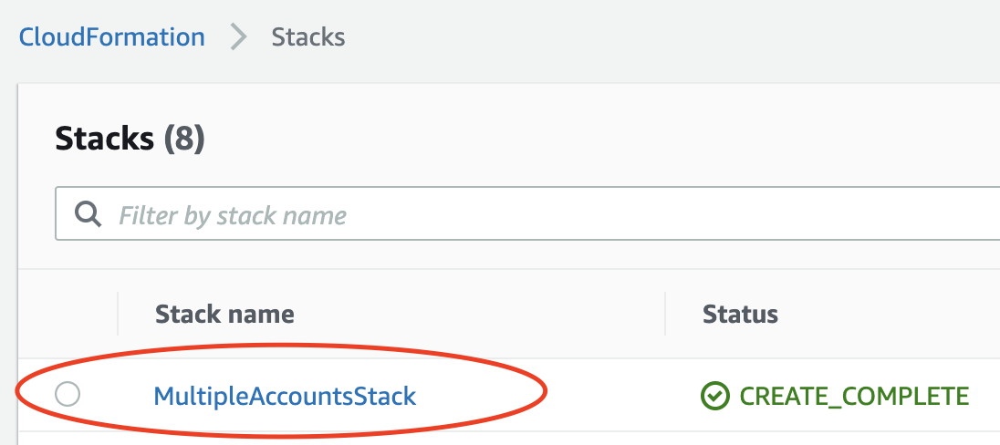
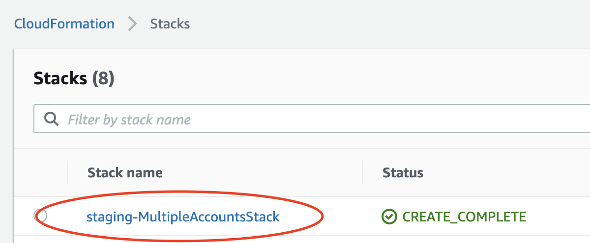

Infrastructure as a code greatly improves traceability, repeatability and thus overall quality of the software systems built with it.
With a correct setup development teams can now more easily spin up short-lived clones of systems or their parts.
This gives a profound boost in both productivity but also ability to run automated regression or performance tests.

In this post I will show how to use aws-cdk to deploy multiple copies of the same application:

[**1. Using multiple AWS accounts.**](#using-multiple-aws-accounts-to-deploy-copies-of-the-same-aws-cdk-application)

[**2. Using a single AWS account.**](#using-single-aws-account-to-deploy-copies-of-the-same-aws-cdk-application)


## Using multiple AWS accounts to deploy copies of the same aws-cdk application

By default, every aws-cdk `Stack` you create is environment-agnostic.
You can deploy an environment-agnostic stack with any AWS account granted you have enough entitlements.
Note that AWS account does not mean IAM user. A single AWS account can have multiple IAM users.


The `cdk deploy` command uses specified AWS profile or a default one.

Let us start with a bare bone app `multiple-accounts` generated with:

```shell
mkdir multiple-accounts && cd multiple-accounts
npx cdk init --language typescript
```

To make our example more entertaining I added a single S3 Bucket to the `MultipleAccountsStack`:

```typescript
import * as cdk from "@aws-cdk/core";
import * as s3 from "@aws-cdk/aws-s3";

export class MultipleAccountsStack extends cdk.Stack {
  constructor(scope: cdk.Construct, id: string, props?: cdk.StackProps) {
    super(scope, id, props);

    new s3.Bucket(this, "MyBucket");
  }
}
```

I also created 2 AWS profiles for 2 AWS accounts, using `aws configure`, named `blog-staging` and `blog-production` for demonstration.

### Deploy aws-cdk app using explicitly specified profile

For start let's use `--profile` parameter to deploy our stacks:

```shell
> npx cdk deploy --profile blog-staging

MultipleAccountsStack: deploying...
MultipleAccountsStack: creating CloudFormation changeset...
 ...

 ✅  MultipleAccountsStack

Stack ARN:
arn:aws:cloudformation:eu-central-1:XXXXXXXXXX:stack/MultipleAccountsStack/0d3c7530-a318-11ea-ab8d-02b8022d5b40

> npx cdk deploy --profile blog-production

MultipleAccountsStack: deploying...
MultipleAccountsStack: creating CloudFormation changeset...
...

 ✅  MultipleAccountsStack

Stack ARN:
arn:aws:cloudformation:eu-central-1:YYYYYYYYYY:stack/MultipleAccountsStack/3a5cc690-a319-11ea-b00b-023cc2de05b4
```

Note how `XXXXXXXXXX` and `YYYYYYYYYY` identifies, which AWS account deployed the stack.
The stack has the same **name** in both cases: `MultipleAccountsStack`



You can specify the AWS profile to use with `AWS_PROFILE` environment variable:

```shell
AWS_PROFILE=blog-production npx cdk deploy
```

Last but not least the standard AWS CLI environment variables work as well:

```shell
export AWS_ACCESS_KEY_ID=xxxx
export AWS_SECRET_ACCESS_KEY=yyy
export AWS_DEFAULT_REGION=eu-central-1
npx cdk deploy
```

Please refer to [the documentation](https://docs.aws.amazon.com/cdk/latest/guide/environments.html) for further details.

### Benefits of using multiple AWS accounts to deploy aws-cdk app

The first advantage is how using multiple AWS accounts keeps aws-cdk code simple.
The infrastructure code ignores details of the environment it runs in. This makes it possible to re-use it in other contexts.
This approach also improves security.
With multiple AWS accounts we minimise risk of aws-cdk installations affecting each other.

### Downsides of using multiple AWS accounts to deploy aws-cdk app

The following example presents a first downside, or in reality a gotcha easy to miss.
Say someone not well versed in AWS services decided to name the bucket:

```typescript
new s3.Bucket(this, "MyBucket", {
  bucketName: "important-assets",
});
```

It will work fine when deployed for the first time. However, as soon as we try to deploy it to a second AWS account we get:

```shell
> npx cdk deploy --profile blog-production
(node:61539) ExperimentalWarning: Conditional exports is an experimental feature. This feature could change at any time
MultipleAccountsStack: deploying...
MultipleAccountsStack: creating CloudFormation changeset...
 0/3 | 10:56:27 AM | CREATE_IN_PROGRESS   | AWS::S3::Bucket    | MyBucket (MyBucketF68F3FF0)
 0/3 | 10:56:27 AM | CREATE_IN_PROGRESS   | AWS::CDK::Metadata | CDKMetadata
 1/3 | 10:56:27 AM | CREATE_FAILED        | AWS::S3::Bucket    | MyBucket (MyBucketF68F3FF0) important-assets already exists
```

Some AWS resources names need a unique name in a given region across all AWS accounts.

The difficulty to create AWS accounts on a developer whim is the second downside.
Remember that want to re-create environments with changed parts.
Forcing a new AWS account may turn out problematic and create a management headache too big to ignore.

## Using single AWS account to deploy copies of the same aws-cdk application

As we saw above by default the Stack name gets derived from the class name.
Thankfully one can easily override that behaviour.
In my projects I prefer using a `DEPLOY_ENV` environment variable to specify the deployment target.

```shell
DEPLOY_ENV=staging npx cdk deploy
```

We need to adjust our app definition so that `DEPLOY_ENV` is recognized.

### Using DEPLOY_ENV variable inside aws-cdk entry point

The aws-cdk app typically resided as `bin` folder. In our example it is the `bin/multiple-accounts.ts` file.
With the following adjustment we can deploy our app to many targets:

```typescript
#!/usr/bin/env node
import "source-map-support/register";
import * as cdk from "@aws-cdk/core";
import { MultipleAccountsStack } from "../lib/multiple-accounts-stack";

const deployEnv = process.env.DEPLOY_ENV || "dev";
const app = new cdk.App();
new MultipleAccountsStack(app, deployEnv + "-MultipleAccountsStack");
```

During deployment aws-cdk will create a CloudFormation stack named `${process.env.DEPLOY_ENV}-MultipleAccountsStack`:



### Using DEPLOY_ENV consistently inside aws-cdk application

As I mentioned above one can easily fall into unique name traps.
In order to avoid naming conflicts and to apply consistent naming scheme I often define a helper similar to the following.

```typescript
function deployEnv() {
  return process.env.DEPLOY_ENV || "dev";
}

function envSpecific(logicalName: string | Function) {
  const suffix =
    typeof logicalName === "function" 
    ? logicalName.name 
    : logicalName;

  return `${deployEnv()}-${suffix}`;
}

export class MultipleAccountsStack extends cdk.Stack {
  constructor(scope: cdk.Construct, props?: cdk.StackProps) {
    super(scope, envSpecific(MultipleAccountsStack), props);

    new s3.Bucket(this, "MyBucket", {
      bucketName: envSpecific("important-assets"),
    });
  }
}
```

With the above change our cdk app entry point no longer decides how to name the stack.
Note however, that you can still allow passing the name through constructor **when** you need it.

Using `envSpecific` helper keeps important resource names consistent.
More importantly it allows deploying as many copies of aws-cdk app as we like.
