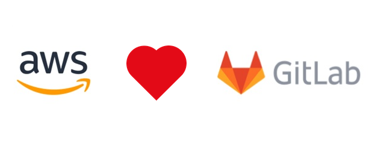
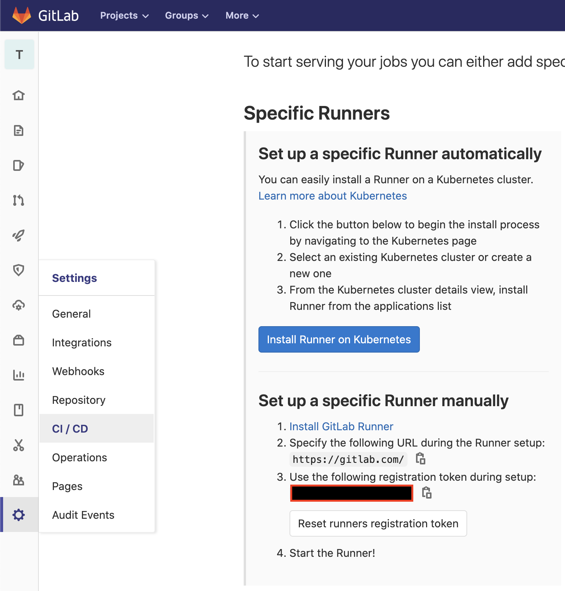

Gitlab offers a robust CI/CD solution suitable for most projects.
The [documentation](https://docs.gitlab.com/ee/user/project/clusters/add_remove_clusters.html) depicts the easiest way to connect your Kubernetes cluster to Gitlab.
Once connected Gitlab can install and configure Gitlab runner.

However, such approach does not allow for many adjustments to Gitlab runner configuration.
For example when using Kubernetes executor providing build level [resource requests and limits](https://docs.gitlab.com/runner/executors/kubernetes.html#overwriting-build-resources) does not work.

In this post we'll use aws-cdk to:

- provision an AWS EKS cluster
- install [cluster autoscaler](https://docs.aws.amazon.com/eks/latest/userguide/cluster-autoscaler.html)
- install Gitlab runner using [Helm chart](https://docs.gitlab.com/runner/install/kubernetes.html)



## Prerequisite

Create an aws-cdk typescript project with necessary dependencies using

```shell
mkdir cicd && cd cicd
npx cdk init --language typescript
npm i --save @aws-cdk/aws-eks
```

## Create EKS Cluster with aws-cdk

First we add an AWS EKS cluster with a managed node group.
[A managed node group](https://docs.aws.amazon.com/eks/latest/userguide/managed-node-groups.html) provides a convenient way to provision and manage nodes.

```typescript
export class CICDStack extends cdk.Stack {
  constructor(scope: cdk.Construct, id: string, props?: cdk.StackProps) {
    super(scope, id, props);

    const clusterAdmin = new iam.Role(this, "Cluster Master Role", {
      assumedBy: new iam.AccountRootPrincipal(),
    });

    const clusterName = "cicd";
    const cluster = new eks.Cluster(this, "CICD Cluster", {
      mastersRole: clusterAdmin,
      clusterName: clusterName,
      defaultCapacity: 0,
    });

    const mainNodeGroup = cluster.addNodegroup("main", {
      desiredSize: 1,
      instanceType: ec2.InstanceType.of(InstanceClass.M5, InstanceSize.XLARGE2),
      nodegroupName: "main",
      maxSize: 10
    });

    ...

  }
}
```

The `clusterAdmin` IAM Role is going to be use to manage the cluster with [kubectl](https://kubernetes.io/docs/tasks/tools/install-kubectl/).
We do not need it to install and configure Gitlab runner. However, it is essential for debugging purposes.

## Install Gitlab runner using Helm chart

For our EKS cluster to perform any CI work we need to install [Gitlab runner](https://docs.gitlab.com/runner/install/kubernetes.html).
Thankfully Gitlab provides [an official Helm chart](https://charts.gitlab.io/).

```typescript
cluster.addChart("gitlab-runner", {
  chart: "gitlab-runner",
  repository: "https://charts.gitlab.io/",
  version: "v0.17.1",
  wait: true,
  values: {
    gitlabUrl: "https://gitlab.com/",
    runnerRegistrationToken: "<runner registration token>",
    rbac: {
      create: true,
    },
    runners: {
      // https://gitlab.com/gitlab-org/charts/gitlab-runner/blob/master/values.yaml
      // required for dind
      privileged: true,
      builds: {
        cpuRequests: "1",
        cpuRequestsOverwriteMaxAllowed: "16",
        cpuLimitOverwriteMaxAllowed: "16",
        memoryRequests: "4Gi",
        memoryLimitOverwriteMaxAllowed: "16Gi",
        memoryRequestsOverwriteMaxAllowed: "16Gi",
      },
    },
  },
});
```

For the Gitlab runner to register in Gitlab server we need to get a runner registration token.
You can find the runner registration token on a project or group CI/CD settings page.
In the above example I passed the value as is to the `runnerRegistrationToken` setting.
However, you should not commit that into source control and instead use an environment variable,
or [a parameter store reference](https://docs.aws.amazon.com/cdk/latest/guide/get_ssm_value.html).



Note that we have configured a couple of values defined in [the Helm chart](https://gitlab.com/gitlab-org/charts/gitlab-runner/blob/master/values.yaml).
Most notably we set the required `cpu*OverwriteMaxAllowed` and `memory*OverwriteMaxAllowed` options.
We have to configure them otherwise it will not be possible to set Kubernetes CPU and memory allocations for requests and limits on the `.gitlab-ci.yml`.
With the above set we can request a certain amount of CPU and memory for build:

```yaml
 variables:
   KUBERNETES_CPU_REQUEST: 3
   KUBERNETES_CPU_LIMIT: 5
   KUBERNETES_MEMORY_REQUEST: 2Gi
   KUBERNETES_MEMORY_LIMIT: 4Gi
```

## Install Cluster autoscaler using aws-cdk construct

In order for our AWS EKS cluster to scale dynamically we need to install [Cluster autoscaler](https://docs.aws.amazon.com/eks/latest/userguide/cluster-autoscaler.html).
With autoscaler installed, whenever the amount of **declared requested** CPU or memory resources exceeds those available on nodes, a new node will be added to the cluster.

I've wrapped the Cluster autoscaler setup [into aws-cdk construct](https://github.com/miensol/miensol.github.io/blob/develop/content/posts/gitlab-ci-kubernetes-cluster/cicd/lib/cluster-autoscaler.ts)
With the `ClusterAutoscaler` construct we can simply enhance our EKS Cluster by adding the following to the `CICDStack` definition:

```typescript
new ClusterAutoscaler(this, "cluster-autoscaler", {
  cluster: cluster,
  nodeGroups: [mainNodeGroup],
  clusterName,
});
```


## Connect to the cluster with kubectl 

After a deployment the new Gitlab runner becomes available for a project or Gitlab group.
The `cdk deploy` command will also output a hint on how to configure `kubectl` to connect to the cluster.
It will look somewhat similar to the example below:

```shell
aws eks update-kubeconfig --name cicd --region eu-west-1 \
  --role-arn arn:aws:iam::XXXXXXXXXXX:role/CICD-ClusterMasterRoleXXXX-XXXX
```

You only need to execute the above command once. It will store the configuration for `kubectl` on your local disk.
Afterwards you can inspect the EKS Kubernetes cluster with `kubectl` e.g:

```shell
> kubectl get pods 
NAME                                                              READY   STATUS    RESTARTS   AGE
cicdcicdclusterchartgitlabrunnerdXXXXX-gitlab-runner-XXXXXXXXXX   1/1     Running   0          26h
```

You can find full working example [under the github repository](http://github.com/miensol/miensol.github.io/blob/develop/content/posts/gitlab-ci-kubernetes-cluster/cicd).
