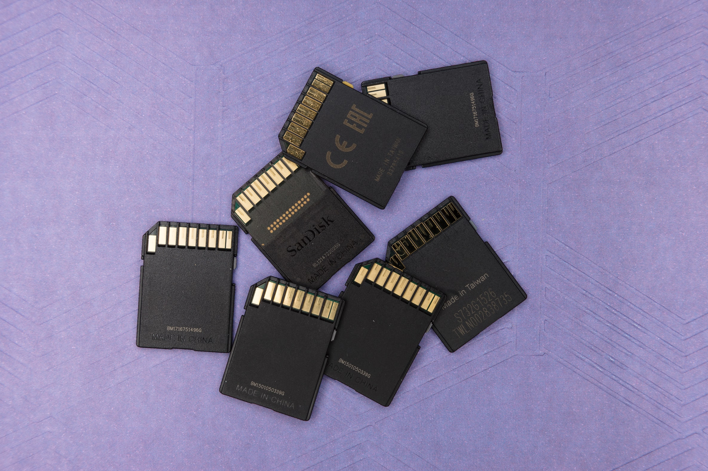

By end of
August [AWS will shut down EC2-Classic networking](https://aws.amazon.com/blogs/aws/ec2-classic-is-retiring-heres-how-to-prepare/)
. All resources using EC2-Classic networking will stop working. Yes, this includes RDS databases.

One of our clients was running a PostgreSQL RDS instance in EC2-Classic. We've notified the client
about the necessary migration right after AWS published the news. Since the database was used for
mission-critical features it was vital to plan the migration carefully.

## The plan

There are several risks at play when migrating data. They can be divided into 2 major categories:

a) data loss

b) service outage

Preparing a thorough migration plan helps to reduce those risks. Losing data was not an option. We
could also afford only limited degradation of service. With a database size of several hundreds of
GB, any operation isn't instant. It will take a couple of hours just to copy the data. The client
agreed that it would be ok if the service showed stale data for a couple of minutes.

With the constraint defined we've come up with the following plan.

## Step 1: Replicate database

As I mentioned it will take several hours to just copy the data. This rules out a simple take
snapshot & restore approach. Fortunately, databases have solved this problem a long time ago with
replication. The first step is thus to create a fresh new RDS database inside VPC. We can use a
snapshot of the source database to speed up initial replication. Please note that at this point the
fresh database isn't used by any production service yet!
Once the data wills start flowing from the EC2-Classic RDS instance to VPC based one we can safely
prepare for the next step.

## Step 2: Setup a custom database host DNS record

We need to have a way to instruct all clients connecting to the database to switch to a new
database. One way to achieve that is to use DNS. During the migration, we'll update the DNS record.
This method isn't ideal. Existing connections will not be automatically served. However, in the case
of our clients, it was perfectly ok to request rolling reboots of database client service.

## Step 3: Migration!

Once we have a fresh, up-to-date database instance ready inside VPC we can finally switch to the new
database. Simply swapping the DNS record would put us at risk of violating data integrity. To
mitigate that we'll put the source database into read-only mode right before swapping the DNS
record. Such a change ensure that once the DNS switch takes place, any writes happen only at the VPC
based database!

## Conclusion

Migrating production services is challenging and risky. However, with the right plan, the risk can
be mitigated to an acceptable level. In my opinion, automating most if not the whole process reduces
the risk further. This is why we've implemented the migration from EC2-Classic to VPC using AWS-CDK.

_In the following posts, I'll share more details on the automation that we've implemented._

1. [Step 1: Replicate database](/migrating-ec2-classic-rds-to-vpc-step-1) 
