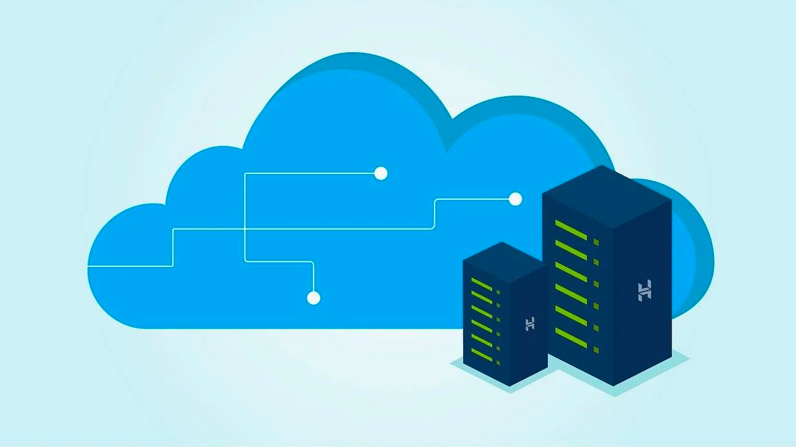

In [the plan blog post](/migrating-ec2-classic-rds-to-vpc-plan) I sketched a plan to migrate an
EC2-Classic RDS database to a VPC. Now we can perform the 2nd step of the plan.
This is a simple step. Albeit, we have to understand what are the consequences.
In your case, this approach might need adjustments!



## The RDS endpoint DNS

When you create an RDS database instance or RDS database cluster AWS provides you with endpoint 
addresses. The addresses can be used to connect to the database. 
You cannot change the endpoint address of the RDS database. 
It is something generated by AWS that you have no influence over.

As planned we want to update the DNS entry when migrating to VPC based RDS instance.
For these two work, we need a custom DNS entry. One that we can control.

## Private hosted zone

Often, when deploying services inside a VPC it makes sense to use a private DNS hosted zone.
Such an approach allows us to define e.g. `internal` DNS space which we can freely use.
With AWS-CDK defining such hosted zone is simple:

```typescript
class NetworkStack extends Stack {
  readonly privateHostedZone: IPrivateHostedZone
  constructor(scope: Construct, id: string, props?: StackProps) {
    super(scope, id, props);
    
    const vpc = new Vpc(this, 'vpc', {
      ...
    })

    this.privateHostedZone = new PrivateHostedZone(this, 'internal', {
      vpc: vpc,
      zoneName: 'internal',
      comment: 'private DNS space for registering services'
    });
  }
}
```

## Custom DNS record for database endpoint

Now that we have a private hosted zone we can define a custom DNS record for the database.
The record should be used to connect to the database from our service(s). 
This way once we change the record the application will establish connections to a new database running
inside VPC.

```typescript
new CnameRecord(this, 'database cname record', {
  domainName: 'current-classical-database-endpoint',
  zone: this.privateHostedZone,
  recordName: 'database'
})
```

With the above configuration deployed all that is left to do is to update our service configuration.
The database hostname that we set should now look like `database.internal`. Please note that we are 
still connected to the non-VPC, classical RDS instance.

## Important considerations

The approach that we have selected is simple. However, it is not without downsides.
The main issue is that the DNS update will not immediately cause all services to connect to the new database.
In many cases this is fine. 
Moreover, we need to make sure that our database clients do not cache DNS entries for too long.

If you need the connections to be moved to a new database instance in a more controllable fashion it is still possible.
A deployment with an update of the database configuration of services might be enough. 
If such a deployment is not an option we can introduce a network proxy e.g. using a network load balancer, ProxySQL or HAProxy.   
